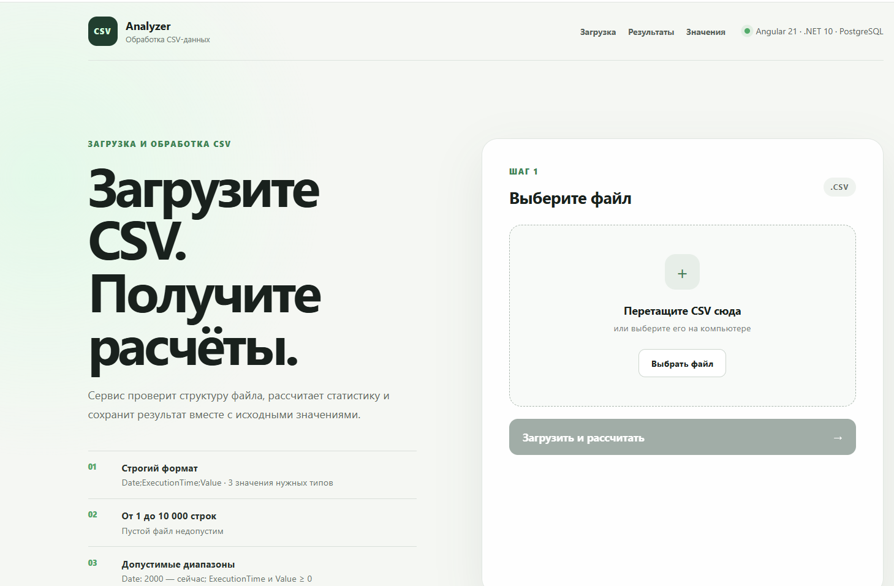
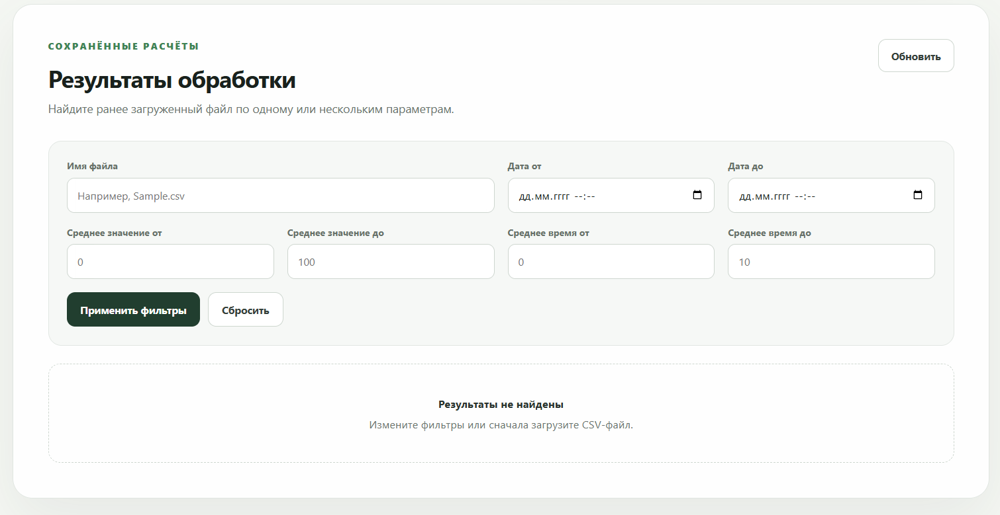
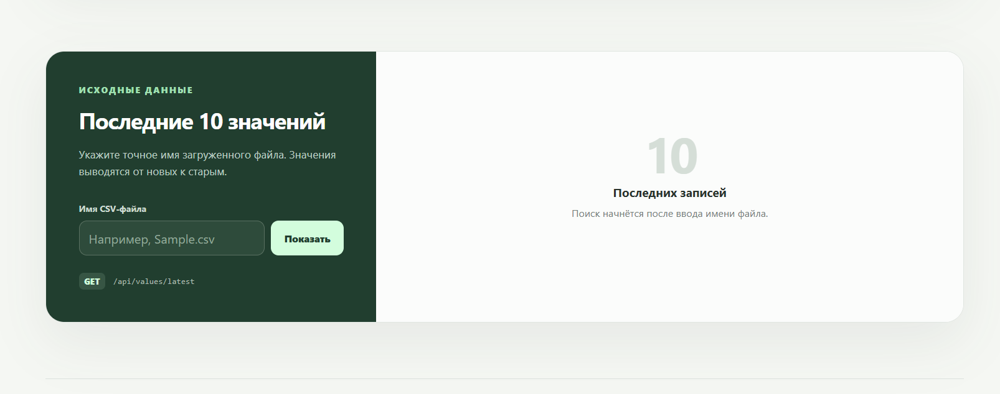
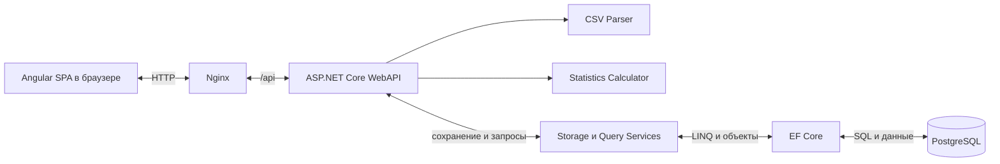

# CSV Data Processing API

WebAPI-приложение для загрузки, проверки и обработки данных из CSV-файлов. Приложение рассчитывает статистические показатели, сохраняет исходные значения и результаты в PostgreSQL, позволяет фильтровать результаты и получать последние 10 значений выбранного файла.

В репозитории также находится Angular 21 SPA для работы со всеми методами API и Docker Compose для совместного запуска клиента, WebAPI и базы данных.

## Возможности

- загрузка CSV-файла через HTTP-форму (multipart/form-data);
- валидация структуры и значений файла;
- расчёт статистики по данным файла;
- сохранение значений и результатов в PostgreSQL;
- атомарная перезапись данных при повторной загрузке файла с тем же именем;
- фильтрация сохранённых результатов;
- получение последних 10 значений заданного файла;
- интерактивная документация Swagger;
- Angular 21 SPA;
- автоматические backend- и frontend-тесты;
- запуск всего приложения одной командой через Docker Compose.

## Веб-интерфейс

Angular SPA объединяет все основные сценарии работы с приложением на одной странице.

### Загрузка CSV-файла

<p align="center">
  
</p>

### Поиск результатов

<p align="center">
  
</p>

### Последние значения

<p align="center">
  
</p>

## Технологии

| Часть | Технологии |
|---|---|
| Backend | ASP.NET Core Web API, .NET 10, C# |
| Доступ к данным | Entity Framework Core 10, Npgsql |
| База данных | PostgreSQL 16 |
| API-документация | Swagger / OpenAPI |
| Frontend | Angular 21, TypeScript, SCSS |
| Тестирование | xUnit, WebApplicationFactory, SQLite in-memory, Vitest |
| Контейнеризация | Docker, Docker Compose, Nginx |

## Архитектура



Backend организован как небольшое слоистое приложение:

- **Controllers** принимают HTTP-запросы и формируют ответы;
- **Services** содержат разбор CSV, расчёты, сохранение и запросы;
- **Contracts** описывают модели запросов и ответов API;
- **Entities** описывают таблицы базы данных;
- **Data** содержит `DbContext` и миграции EF Core.

Основные сервисы имеют одну ответственность:

- `CsvParser` читает и проверяет CSV;
- `CsvStatisticsCalculator` рассчитывает статистику;
- `CsvStorageService` транзакционно сохраняет или заменяет данные;
- `ResultQueryService` применяет фильтры к результатам;
- `ValueQueryService` получает последние значения.

## Структура репозитория

```text
WebAPI/
├── README.md
├── images/                       # скриншоты Angular SPA
├── WebApplication1/
│   ├── WebApplication1/          # ASP.NET Core WebAPI
│   ├── WebApplication1.Tests/    # backend-тесты
│   ├── client/                   # Angular SPA
│   ├── ManualTests/              # CSV для ручных проверок
│   ├── docker-compose.yml
│   ├── .env.example
│   └── WebApplication1.slnx
└── .gitignore
```

## Формат CSV

Заголовок должен в точности соответствовать строке:

```csv
Date;ExecutionTime;Value
```

Пример корректного файла:

```csv
Date;ExecutionTime;Value
2026-01-10T10:00:00Z;1.2;10.5
2026-01-10T10:00:30Z;2.4;20.5
```

Поля:

- `Date` - дата и время начала операции в ISO 8601;
- `ExecutionTime` - время выполнения в секундах;
- `Value` - показатель в виде числа с плавающей точкой.

### Правила валидации

- дата должна быть не раньше `01.01.2000` и не позже текущего момента;
- `ExecutionTime` должен быть неотрицательным конечным числом;
- `Value` должен быть неотрицательным конечным числом;
- строка должна содержать ровно три значения;
- файл должен содержать от 1 до 10 000 строк данных;
- допускаются только файлы с расширением `.csv`;
- имя файла не должно превышать 255 символов.

Если файл невалиден, API возвращает `400 Bad Request`, а изменения в базе данных не сохраняются.

## Рассчитываемая статистика

Для каждого файла рассчитываются:

- разница между максимальным и минимальным `Date` в секундах;
- дата первой операции;
- среднее время выполнения;
- среднее значение показателя;
- медиана показателя;
- максимальное значение;
- минимальное значение.

В таблице `Results` хранится одна запись на имя файла. Повторная загрузка файла с тем же именем транзакционно заменяет прежний результат и связанные значения.

## API

| Метод | Адрес | Назначение |
|---|---|---|
| `POST` | `/api/files/upload` | Загрузить, проверить и сохранить CSV |
| `GET` | `/api/results` | Получить результаты с необязательными фильтрами |
| `GET` | `/api/values/latest?fileName=...` | Получить последние 10 значений файла |

### Загрузка CSV

Поле формы должно называться `file`.

Из корня репозитория:

```powershell
curl.exe -X POST "http://localhost:8080/api/files/upload" `
  -F "file=@.\WebApplication1\Sample.csv"
```

### Фильтры результатов

Метод `GET /api/results` поддерживает следующие query-параметры:

| Параметр | Назначение |
|---|---|
| `fileName` | Точное имя файла |
| `firstOperationDateFrom` | Начало диапазона даты первой операции |
| `firstOperationDateTo` | Конец диапазона даты первой операции |
| `averageValueFrom` | Минимальное среднее значение |
| `averageValueTo` | Максимальное среднее значение |
| `averageExecutionTimeFrom` | Минимальное среднее время выполнения |
| `averageExecutionTimeTo` | Максимальное среднее время выполнения |

Пример:

```powershell
curl.exe "http://localhost:8080/api/results?fileName=Sample.csv&averageValueFrom=10&averageValueTo=20"
```

### Последние значения

```powershell
curl.exe "http://localhost:8080/api/values/latest?fileName=Sample.csv"
```

## Быстрый запуск через Docker

### Требования

- Docker Desktop с поддержкой Docker Compose.

### Получение проекта

Если репозиторий ещё не клонирован, выполните:

```powershell
git clone https://github.com/usernamealreadytaken123/WebAPI.git
cd .\WebAPI
```

### Запуск

Из корня репозитория:

```powershell
cd .\WebApplication1
Copy-Item .env.example .env
docker compose up -d --build
```

При необходимости измените пароль и порты в созданном `.env` перед запуском.

Файл `.env` содержит локальные настройки, включая пароль PostgreSQL, и не должен добавляться в Git. Он уже указан в `.gitignore`.

После запуска доступны:

| Сервис | Адрес |
|---|---|
| Angular SPA | <http://localhost:4200> |
| Swagger | <http://localhost:8080/swagger/index.html> |
| WebAPI | <http://localhost:8080> |
| PostgreSQL | `localhost:5433` |

Корневой адрес WebAPI не содержит веб-страницы и может вернуть `404 Not Found` — это ожидаемое поведение. Для проверки API используйте Swagger или конкретные адреса `/api/...`.

Проверка состояния контейнеров:

```powershell
docker compose ps
```

Просмотр логов:

```powershell
docker compose logs -f
```

Остановка:

```powershell
docker compose down
```

Данные PostgreSQL сохраняются в Docker volume `postgres_data`. Команда `docker compose down -v` дополнительно удалит сохранённые данные.

## Локальный запуск без Docker

Потребуются:

- .NET 10 SDK;
- PostgreSQL;
- Node.js 24 и npm.

### Backend

Запустите локальный PostgreSQL. Затем подключитесь в pgAdmin к серверу, выберите служебную базу `postgres`, откройте **Query Tool** и выполните:

```sql
CREATE DATABASE timescale_db;
```

Если база `timescale_db` уже существует, повторно создавать её не нужно.

После этого из корня репозитория сохраните строку подключения через User Secrets и запустите WebAPI:

```powershell
cd .\WebApplication1\WebApplication1

$securePassword = Read-Host "PostgreSQL password" -AsSecureString
$plainPassword = [System.Net.NetworkCredential]::new("", $securePassword).Password

dotnet user-secrets set "ConnectionStrings:PostgreSql" `
  "Host=localhost;Port=5432;Database=timescale_db;Username=postgres;Password=$plainPassword"

Remove-Variable securePassword, plainPassword
dotnet run --launch-profile http
```

Миграции EF Core применяются автоматически при запуске. Backend будет доступен на `http://localhost:5069`, а Swagger — на <http://localhost:5069/swagger/index.html>.

Корневой адрес `http://localhost:5069` также может вернуть `404 Not Found`. Для проверки локально запущенного API используйте Swagger или адреса `/api/...`.

### Frontend

В отдельном терминале:

```powershell
cd .\WebApplication1\client
npm.cmd ci
npm.cmd start
```

SPA будет доступно на `http://localhost:4200`. Dev-сервер Angular перенаправляет запросы `/api` на `http://localhost:5069`.

## Тесты

### Backend

Из корня репозитория:

```powershell
dotnet test .\WebApplication1\WebApplication1.slnx
```

На момент подготовки решения: **65 тестов, 65 успешно**.

Для формирования отчёта покрытия:

```powershell
dotnet test .\WebApplication1\WebApplication1.slnx `
  --collect:"XPlat Code Coverage" `
  --settings .\WebApplication1\WebApplication1.Tests\coverage.runsettings
```

Сгенерированные миграции EF Core исключены из расчёта покрытия.

### Frontend

```powershell
cd .\WebApplication1\client
npm.cmd test -- --watch=false
npm.cmd run build
```

На момент подготовки решения: **4 теста, 4 успешно**.

## Ручная проверка

В каталоге `WebApplication1/ManualTests` находятся примеры корректных и некорректных CSV:

- `ValidSmall.csv` - корректный небольшой файл;
- `ValidLatest12.csv` - проверка ограничения последних 10 значений;
- `InvalidHeader.csv` - неверный заголовок;
- `InvalidDate.csv`, `InvalidOldDate.csv`, `InvalidFutureDate.csv` - ошибки даты;
- `InvalidNegativeExecutionTime.csv`, `InvalidNegativeValue.csv` - отрицательные значения;
- `InvalidMissingValue.csv`, `InvalidTooManyColumns.csv` - неверное количество полей;
- `HeaderOnly.csv` - отсутствие строк данных.

Файлы можно загружать через SPA, Swagger или `curl.exe`.

## Решения по качеству и производительности

- CSV читается построчно с помощью `StreamReader`;
- для входного файла установлен предел в 10 000 строк;
- средние значения, минимум, максимум и диапазон дат вычисляются за один проход;
- дополнительная сортировка выполняется только для расчёта медианы;
- запросы чтения используют `AsNoTracking` и проекции в DTO;
- фильтры выполняются на стороне PostgreSQL;
- для имени файла, диапазонов результатов и последних значений созданы индексы;
- перезапись файла выполняется в транзакции;
- все асинхронные операции поддерживают `CancellationToken`;
- backend, frontend и база данных запускаются изолированно в контейнерах.

## Возможные направления развития

- пагинация метода получения результатов;
- ограничение максимального размера загружаемого файла;
- пакетная вставка значений для файлов большего размера;
- PostgreSQL-интеграционные тесты через Testcontainers.
